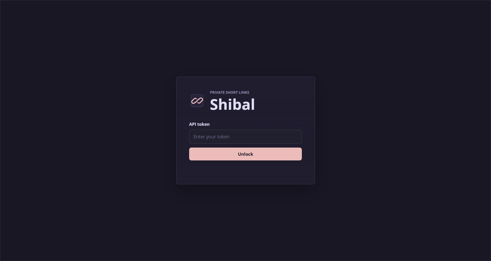
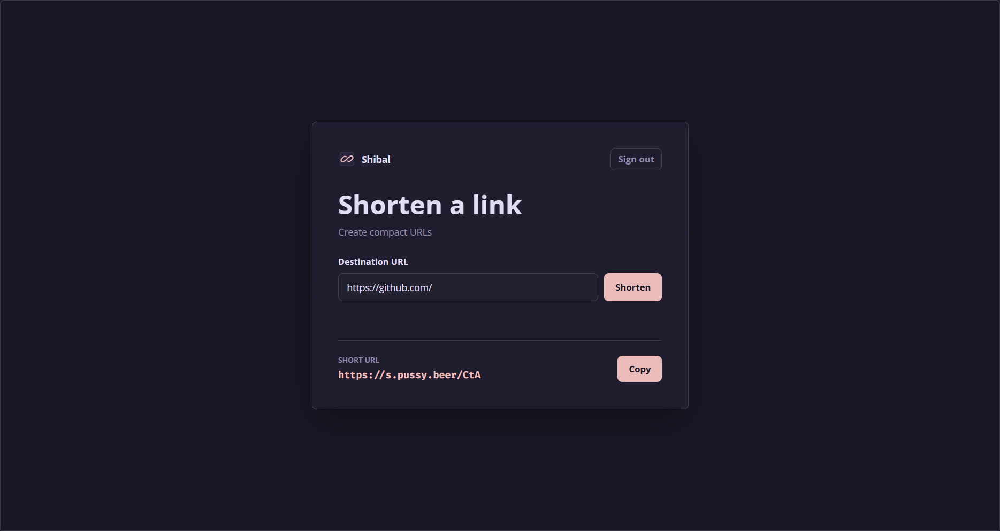

# Shibal

Private URL shortener on Node.js and Express




## Purpose

Shibal creates short links for URLs and stores them in a JSON file without a database. It is built for private use: creating links requires an API token, while following a short link is public

## Features

- Private link creation and public redirects: creating links requires a token, following them does not
- Short links with configurable id length
- No database: links are stored in `data.json`
- Normalized URL deduplication: re-shortening an already stored URL returns the existing short link
- Bare URLs are supported: `example.com` is normalized to `https://example.com/`
- Protocol URLs are supported, including magnet links
- Unsafe protocols are blocked: `javascript:`, `data:`, `file:`, and similar values
- Private token gate for the UI and link creation API
- Atomic `data.json` writes through temp file + rename

## Deployment

Requires Node.js 18+

```bash
npm install
cp .env.example .env
npm start
```

Minimal `.env`:

```env
PORT=7000
BASE_URL=http://localhost:7000
API_TOKEN=super-secret-token

URL_LENGTH=3
```

For production, run the service behind a reverse proxy and set `BASE_URL` to the public URL

Data lives in `data.json`

Back up this file to preserve short links

## API

Protected endpoints use this header:

```http
Authorization: Bearer <API_TOKEN>
```

API errors use this format:

```json
{
	"error": "Enter a valid link"
}
```

### `POST /auth/verify`

Verifies the API token

Requires authorization

Response:

```json
{ "ok": true }
```

### `POST /shorten`

Creates a short link or returns the existing short link for the same URL

Requires authorization

Request body:

```json
{
	"url": "https://example.com/page"
}
```

Response:

```json
{
	"url": "https://example.com/page",
	"short": "aB3",
	"full": "http://localhost:7000/aB3"
}
```

### `GET /:short`

Redirects to the original URL

Public route

If the short link is not found, Shibal returns the HTML `404` page
